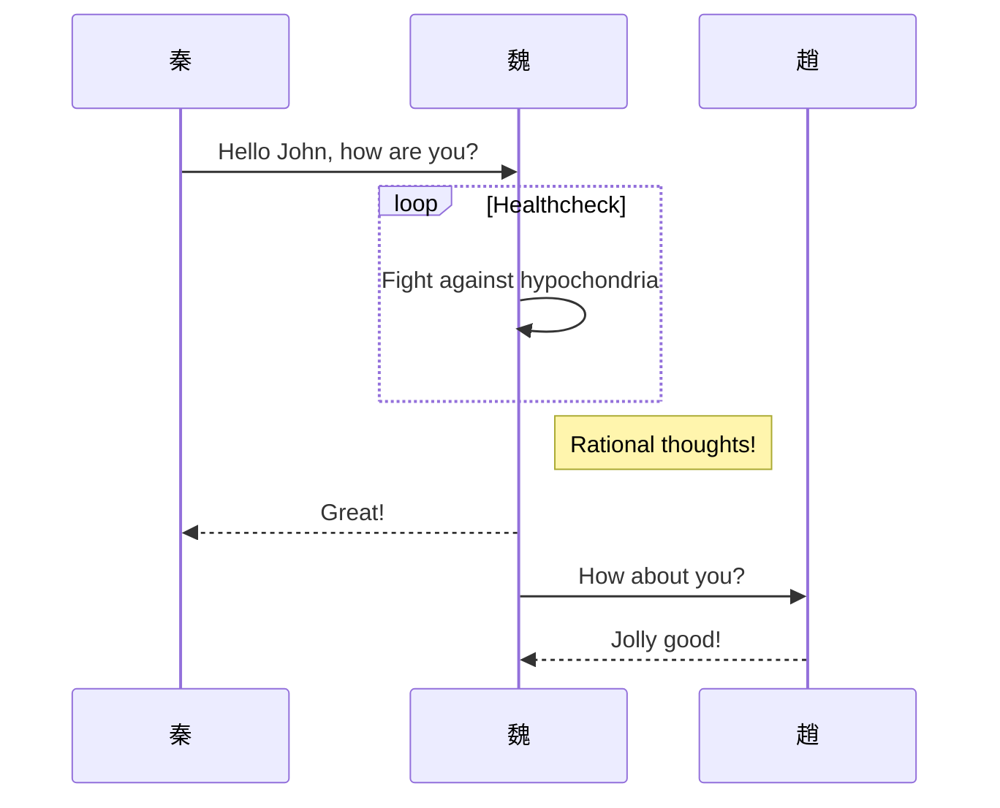

```mermaid
sequenceDiagram
秦->>魏: Hello John, how are you?
loop Healthcheck
    魏->>魏: Fight against hypochondria
end
Note right of 魏: Rational thoughts!
魏-->>秦: Great!
魏->>趙: How about you?
趙-->>魏: Jolly good!
```
